# AUX PROJECT 1: SHELL SCRIPTING

In this project, you need to onboard 20 new Linux users onto a server. Create a shell script that reads a csv file that contains the first name of the users to be onboarded.

Connect to AWS EC2 instance and Update Ubuntu packages

Create the project folder called Shell

`mkdir Shell`

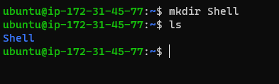

Move into the Shell folder

`cd Shell`

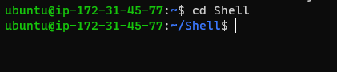

Create a csv file name "names.csv"

`touch names.csv`

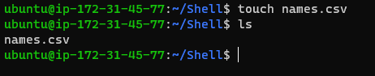

Open the names.csv file and populate it with random names

`vim names.csv`

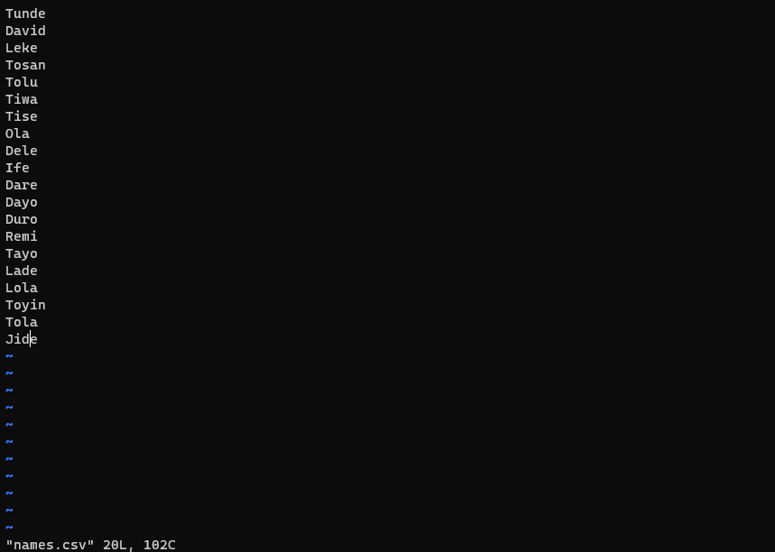

Now open a blank terminal and cd into Downloads (wherever your PEM key is)

Create and copy shell file to be named "onboarding_users" from local machine to the remote machine

`scp -i MyPBL.pem onboarding-users.sh ubuntu@18.216.118.114:~/;`

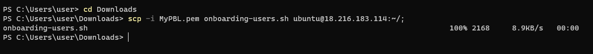

Move the onboarding-users.sh file into Shell directory

`mv onboarding-users.sh /home/ubuntu/Shell`

Create needed private and public keys files

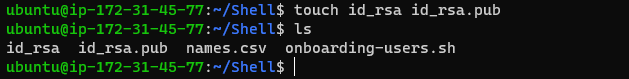

Open the public key file

`vi id_rsa.pub`

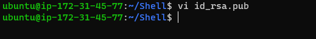

Edit the public key file

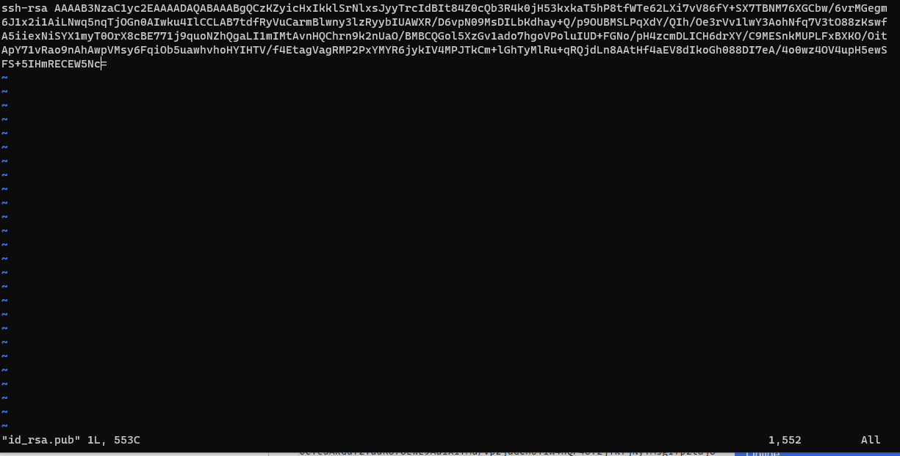

Open the private key file

`vi id_rsa`

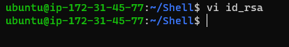

Edit the private key file

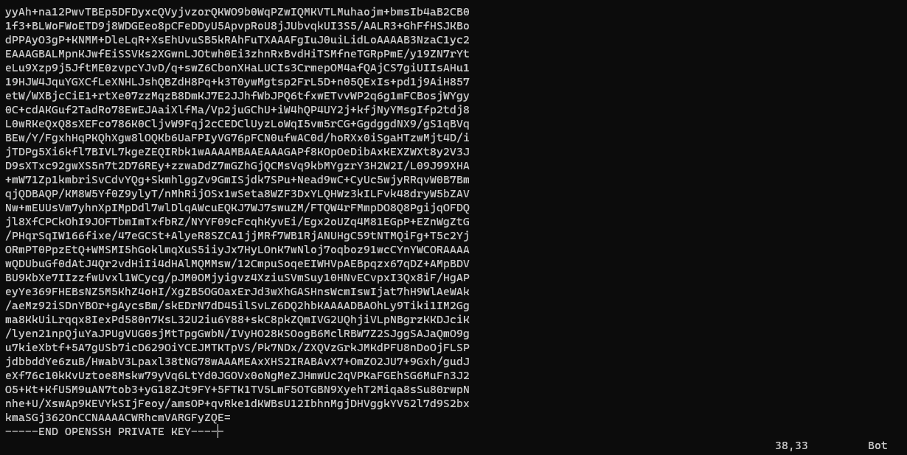

Open and edit the onboard-users.sh file

`vi onboard-users.sh`

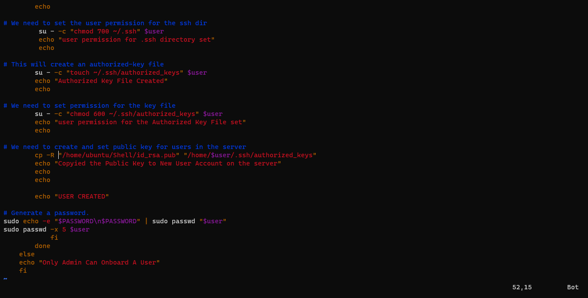

To check if you can add new developers, run

`sudo groupadd developers`

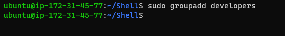

To the onboard-users.sh file, it has to be made executable

`sudo chmod +x onboard-users.sh`

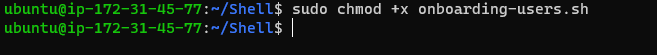

Switch to a super user to get into root

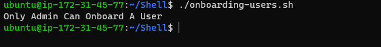

`sudo su`

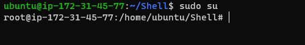

Run the script again with

`./onboard-users.sh`

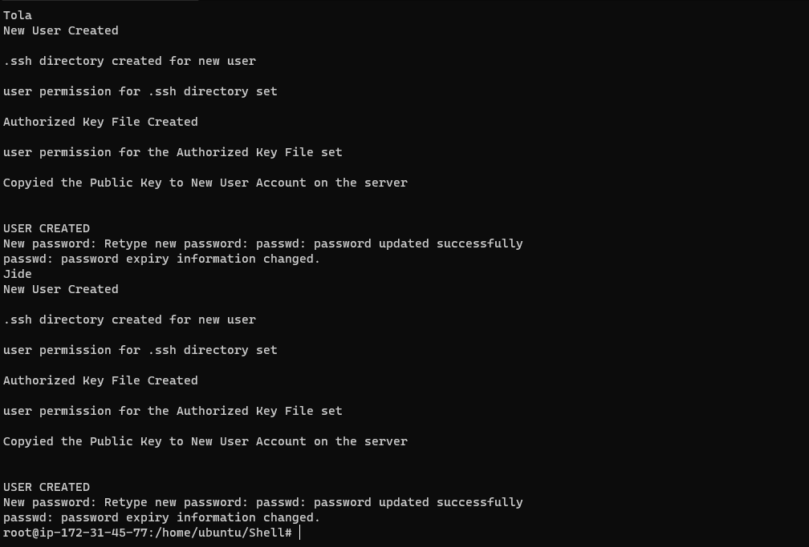

To confirm run the following command

`ls -ls`

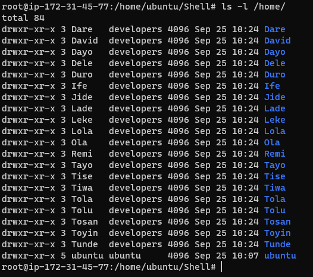

To check if the developers group was created, run the following command

`getent group developers`

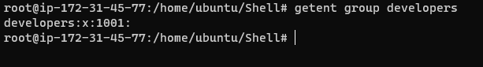

`cat /etc/passwd`

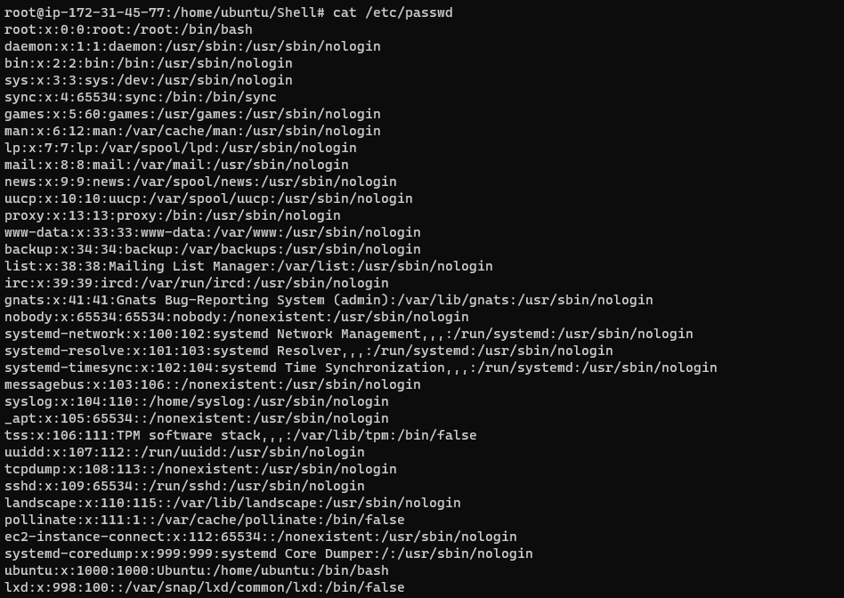
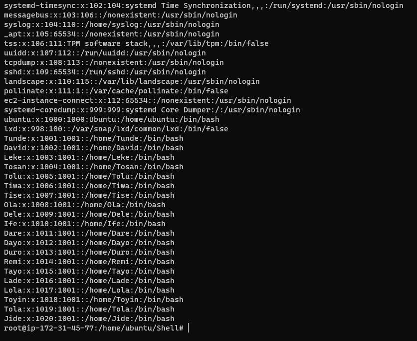

The "awk" command is used to filter the output from above

`cat /etc/passwd | awk -F':' '{print $1}' | xargs -n groups`

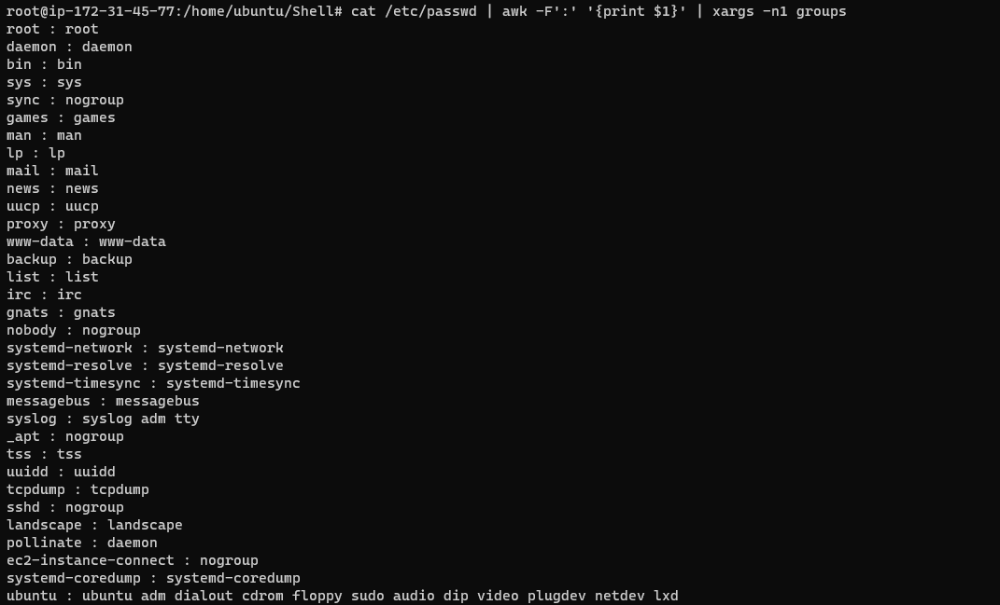
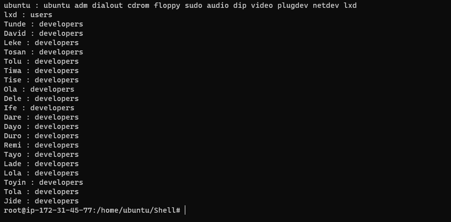

To test the connectivity for the new users,create and copy the pem key into the file

`touch aux-proj.pem`

`vi aux-proj.pem`

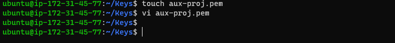

`ssh -i aux-proj.pem Tosan@18.216.183.114`

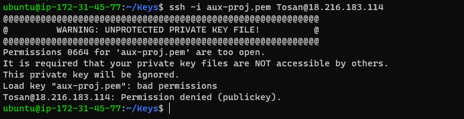

pem key is not well protected

`ls -l | grep aux-proj.pem`

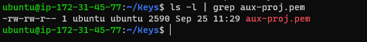

To protect the pem key, run

`sudo chmod 600 aux-proj.pem`

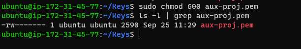

Retry connecting Tosan to the server

`ssh -i aux-proj.pem Tosan@18.216.183.114`

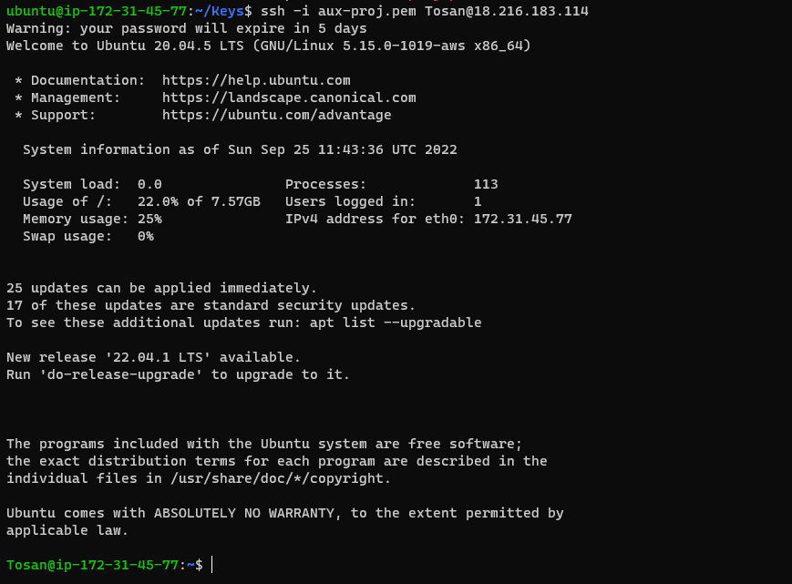

check the user privileges for Tosan

`sudo apt update`

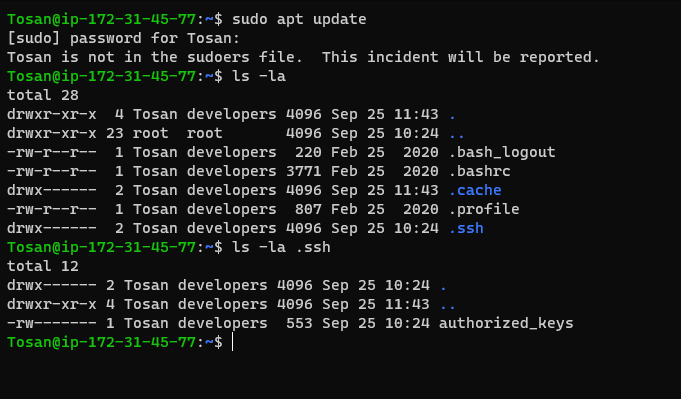

Connecting with Dayo (another new user) to the server

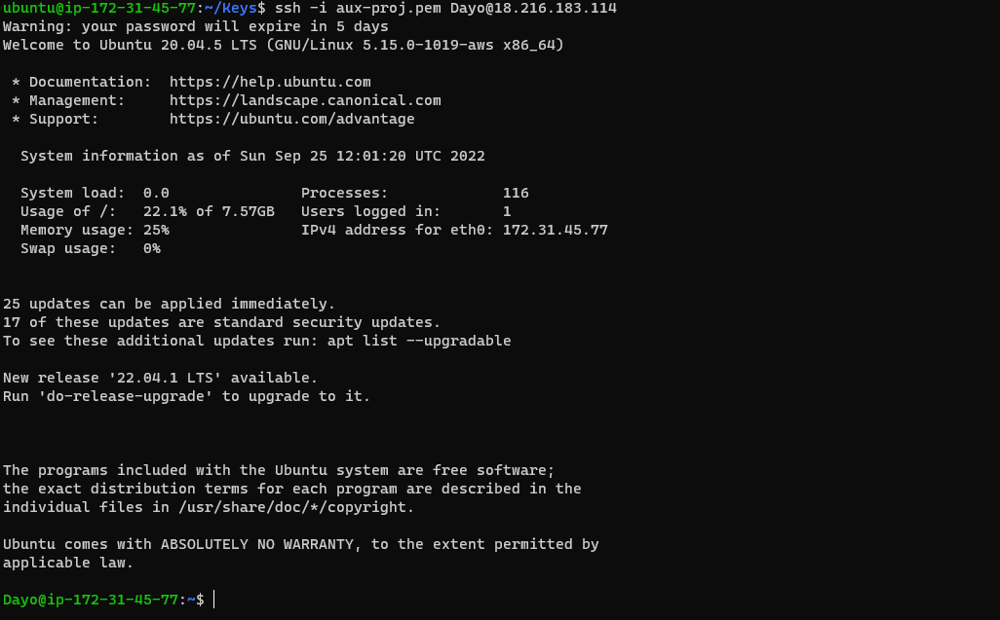

check the user privileges for Dayo

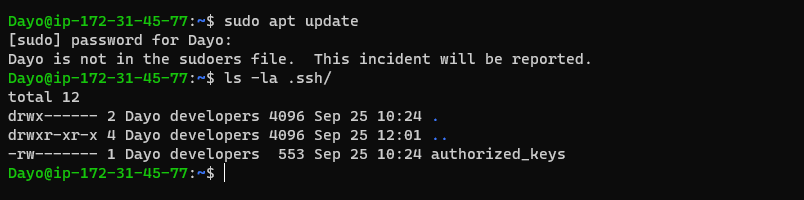

The onboarding of new users is successful.
